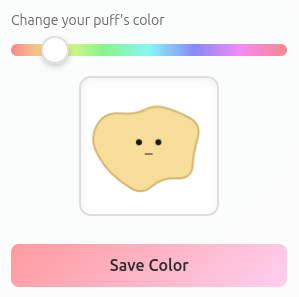
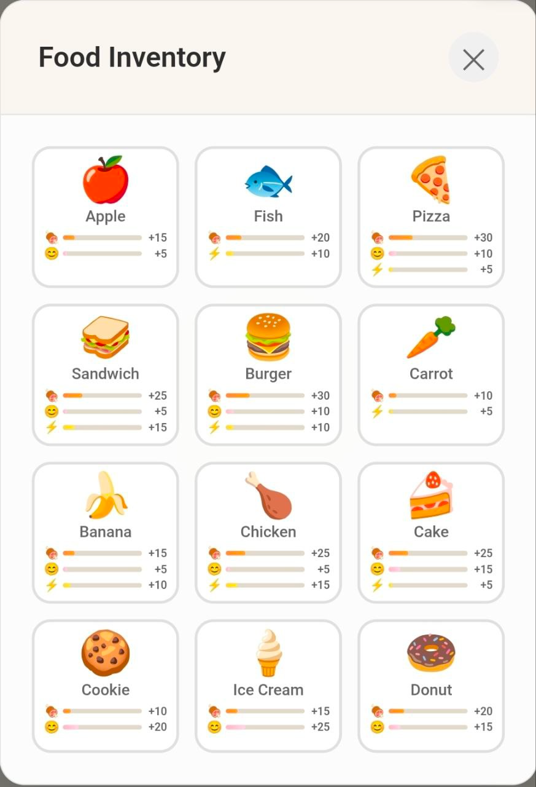
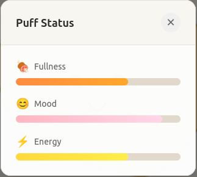

# 🐱 Puff - Your Soft-Body Digital Pet

A calm, satisfying digital companion with realistic physics. Play with it, feed it, put it to sleep - watch it come alive!

---

## ✨ What Can You Do?

**🖐️ Play & Interact**
- Drag and poke your puff - watch it squish, bounce, and deform
- Realistic soft-body physics that feel alive

**🍽️ Care for Your Puff**
- Feed 12 different foods (🍎🐟🍰🍕 and more!)
- Keep it happy, fed, and energized
- Watch mood affect its shape - sad puffs get melty!

**😴 Sleep Mode**
- Tuck your puff in for the night
- Watch it breathe with closed eyes
- Energy recovers while sleeping (5 hours to full)

**🎮 Play Games**
- Catch floating targets to boost your puff's mood
- Relaxing, satisfying gameplay

**🎨 Make It Yours**
- Give your puff a unique name
- Choose its color from soft pastel palette
- Switch between light/dark themes

---

## 📷 Screenshots

    
    
    
    

---

## 🚀 Quick Start

- Just copy and paste the commands in [latest release](https://github.com/EnesBaytekin/puff/releases/latest) on linux.
- Then checkout http://localhost

That's it!

---

## 💾 Persistent

Your puff is saved in the cloud. Stats decay even when you're away, so come back and check on your friend!

---

## 🛠️ Tech Stack

Node.js · Express · PostgreSQL · Docker · Canvas API
